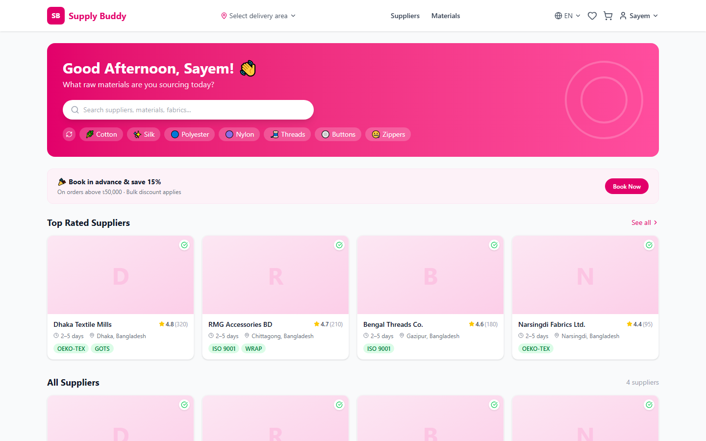
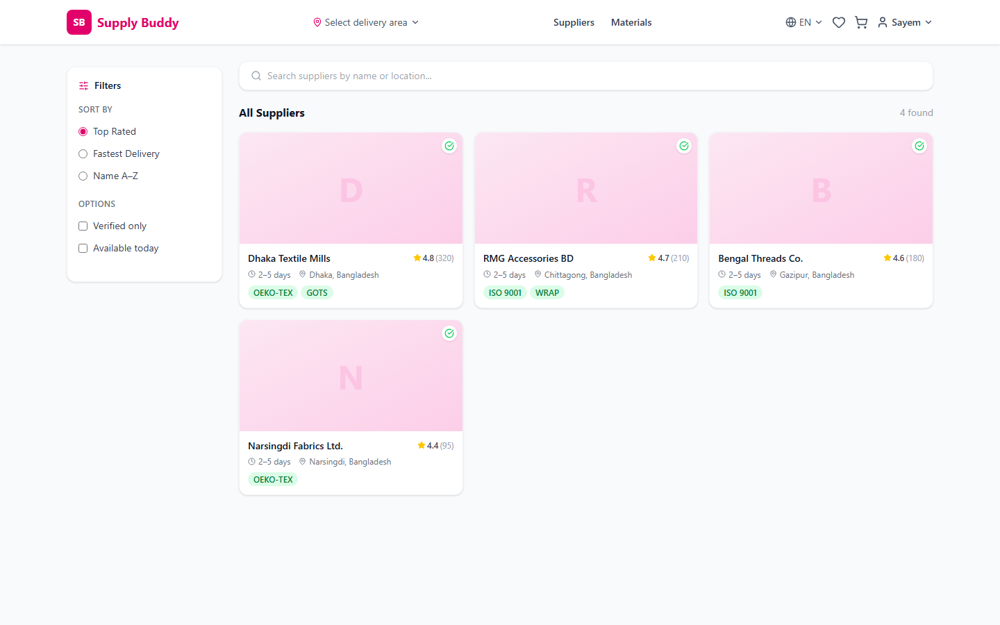
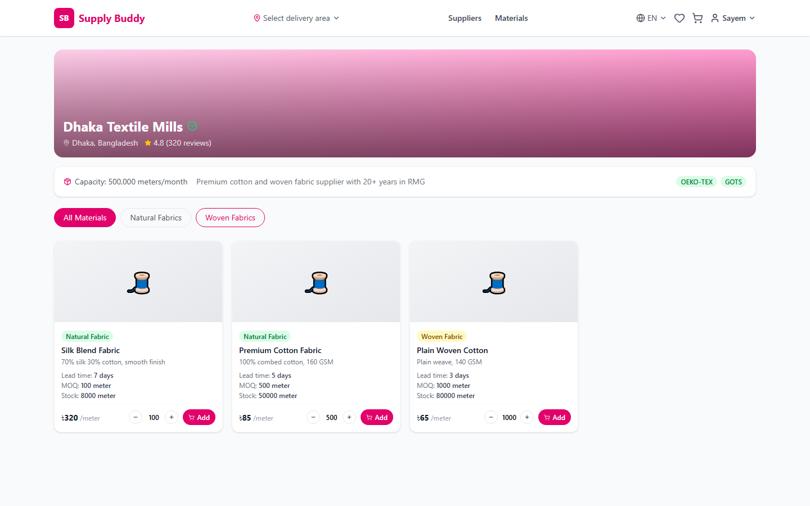
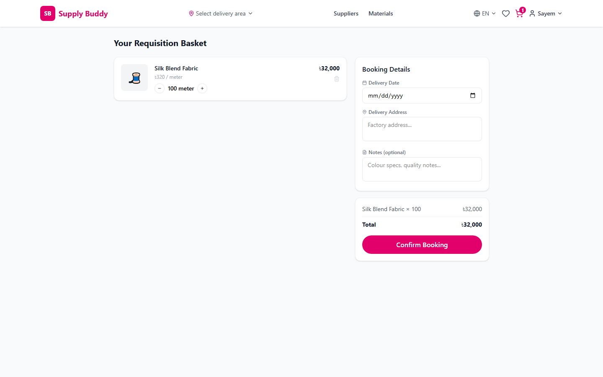
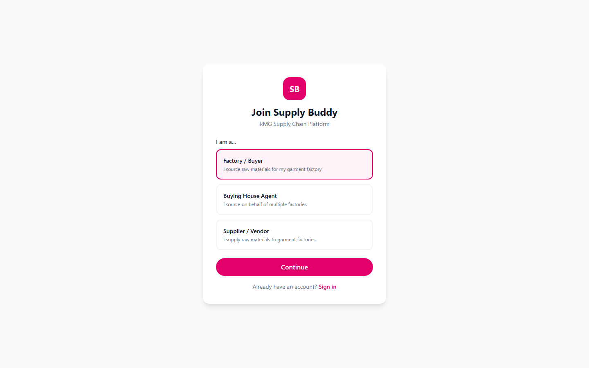
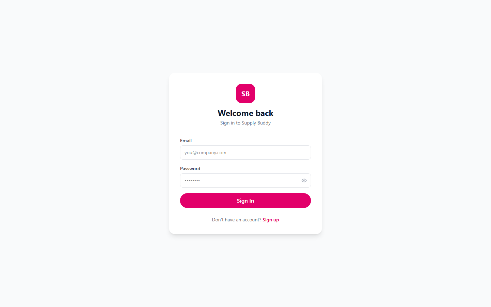

# 🧵 Supply Buddy

## **A FoodPanda-style supply chain platform for Bangladesh's Ready-Made Garments (RMG) industry made ENTIRELY using CLAUDE CODE.** ##
#### **The App: https://supply-dao-app-project.vercel.app/** ####

Supply Buddy connects garment factories and buying houses with verified raw-material suppliers — fabrics, threads, and accessories — so sourcing raw materials feels as easy as ordering food delivery. Browse suppliers, compare materials by category, and book deliveries in advance, all from one dashboard.


---

## 📸 Screenshots

<table>
  <tr>
    <td width="50%">
      <b>Home — Personalized dashboard</b><br/>
      
    </td>
    <td width="50%">
      <b>Supplier Directory — Browse & filter</b><br/>
      
    </td>
  </tr>
  <tr>
    <td width="50%">
      <b>Supplier Profile — Materials catalog</b><br/>
      
    </td>
    <td width="50%">
      <b>Requisition Basket — Advance booking</b><br/>
      
    </td>
  </tr>
  <tr>
    <td width="50%">
      <b>Sign Up — Role selection</b><br/>
      
    </td>
    <td width="50%">
      <b>Login</b><br/>
      
    </td>
  </tr>
</table>

---

## ✨ Features

- **Supplier directory** — search and filter verified suppliers by rating, delivery speed, location, and certifications (OEKO-TEX, GOTS, ISO 9001, WRAP)
- **Raw material catalog** — fabrics (cotton, silk, wool, polyester, nylon, woven), threads (spun polyester, cotton), and accessories (buttons, zippers, fasteners), each with price/unit, MOQ, stock, and lead time
- **Advance booking** — single-supplier "requisition basket" with delivery date, address, and notes, priced in real time
- **Role-based dashboards**
  - 🏭 **Factory / Buyer** — browse, book, and track orders
  - 🧑‍💼 **Buying House Agent** — source on behalf of multiple factories
  - 🏢 **Supplier / Vendor** — manage inventory and fulfil incoming orders through a status pipeline (pending → confirmed → processing → dispatched → delivered)
  - 🛡️ **Platform Admin** — oversight across the marketplace
- **Secure auth** — Supabase Auth with automatic profile provisioning and Row Level Security on every table

---

## 🏗️ Tech Stack

| Layer          | Technology                                             |
| -------------- | ------------------------------------------------------- |
| Frontend       | React 19 + TypeScript + Vite 8 + Tailwind CSS 4          |
| Backend        | Node.js + Express 5                                      |
| Database/Auth  | Supabase (PostgreSQL + Row Level Security + Auth)        |
| Routing        | React Router 7                                           |
| Data fetching  | TanStack Query + Axios                                   |

---

## 📁 Project Structure

```
Supply-Dao-App-project/
├── client/                  # React + TypeScript + Vite frontend
│   └── src/
│       ├── components/      # Layout, cards, badges
│       ├── context/          # Auth & Cart context providers
│       ├── pages/            # Home, directory, profile, buyer/supplier dashboards
│       ├── lib/               # Supabase client, API wrapper
│       └── types/             # Shared TypeScript types
├── server/                   # Node.js + Express backend
│   └── src/
│       ├── routes/            # bookings, materials, suppliers
│       ├── middleware/         # Supabase JWT auth
│       └── lib/                # Supabase service client
├── screenshots/               # App screenshots used in this README
├── supabase_schema.sql         # Database schema, enums, triggers, RLS policies (idempotent)
└── supabase_seed.sql            # Optional sample data (suppliers + materials) — dev only
```

---

## 🚀 Getting Started

### Prerequisites

- Node.js 18+
- A [Supabase](https://supabase.com) project

### 1. Clone and install

```bash
git clone https://github.com/mohammedsayemqazi-byte/Supply-Dao-App-project.git
cd Supply-Dao-App-project

cd client && npm install
cd ../server && npm install
```

### 2. Configure environment variables

Copy the example files and fill in your own Supabase project credentials:

```bash
cp client/.env.example client/.env
cp server/.env.example server/.env
```

| File               | Variable                  | Where to find it                                          |
| ------------------ | ------------------------- | ----------------------------------------------------------- |
| `client/.env`       | `VITE_SUPABASE_URL`         | Supabase Dashboard → Project Settings → API                 |
| `client/.env`       | `VITE_SUPABASE_ANON_KEY`    | Supabase Dashboard → Project Settings → API (publishable key) |
| `server/.env`       | `SUPABASE_URL`               | Same project URL as above                                    |
| `server/.env`       | `SUPABASE_SERVICE_KEY`       | Supabase Dashboard → Project Settings → API (**secret** key — never expose client-side) |

### 3. Set up the database

In the Supabase SQL Editor, run:

1. **[`supabase_schema.sql`](supabase_schema.sql)** — creates all tables, enums, the auto-profile trigger, and Row Level Security policies. Safe to re-run.
2. *(Optional, dev only)* **[`supabase_seed.sql`](supabase_seed.sql)** — populates sample suppliers and materials. Replace the placeholder UUID with a real supplier account's ID first (see comments in the file). **Do not run in production.**

### 4. Run the app

```bash
# Terminal 1 — backend
cd server && npm run dev

# Terminal 2 — frontend
cd client && npm run dev
```

The app will be available at **[http://localhost:5173](https://supply-dao-app-project.vercel.app/)** (backend API on port `5000`).

---

## 👥 User Roles

| Role                  | Description                                                   |
| ---------------------- | --------------------------------------------------------------- |
| **Factory / Buyer**      | Sources raw materials for a garment factory                     |
| **Buying House Agent**    | Sources materials on behalf of multiple factories                |
| **Supplier / Vendor**      | Lists materials, manages inventory, and fulfils bookings          |
| **Platform Admin**          | Oversees the marketplace                                          |

---

## 🔒 Security Notes

- Row Level Security is enabled on every table — buyers only see their own bookings, suppliers only manage their own listings.
- `SUPABASE_SERVICE_KEY` is a secret key used only by the backend server — never commit it or expose it to the frontend.
- Real `.env` files are git-ignored; only `.env.example` templates are tracked.
